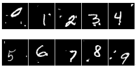

# CS420 Project: MNIST Handwritten-Digits Recognition

In this project, we investigate the mainstream techniques used in hand-written digit recognition task and propose semi-supervise(self-supervise) approaches in dealing with digits recognition with only a small fraction of labeled images. The dataset given for this project is based on Mixed National Institute of Standards and Technology database (MNIST) with transformations like adding noise and moving digit center. Traditional machine learning models like softmax regression, support vector machine (SVM), k-nearest neighbors(k-NN) as well as more advanced deep learning approaches like VGG, Resnet are also included. Some models can achieve nearly perfect performance(99%+ accuracy). Finally, we present our new method which shows comparable performance to most state-of-art models while only use negligible samples.



### Overview

1. Traditional Machine Learning

2. ResNet and VGG

3. Virtual Adersarial Training

4. Deep Generate Model

### Usage

1. Download and extract the dataset:

    ```shell
    ./dataset.sh
    ```

2. Traditional Machine Learning:

    You can run *SVM* model just like below. The `model_type` can be `svm`, `nusvm`, `knn`, `lr`. And you can see more optioal with `python main.py --help`

    ```shell
    cd traditional_machine_learning/
    python main.py --model_type svm
    # if you want to use PCA and knn
    python main.py --model_type knn --pca
    ```

3. ResNet and VGG:

    ```shell
    cd resnet_and_vgg/
    # if you want to try vgg
    python main_vgg.py
    # if you want to try resnet
    python main_resnet.py
    ```

4. Virtual Adersarial Training

    ```shell
    
    ```

5. Deep Generate Model:

    ```shell
    cd deep_generate_model/
    python main.py
    ```

### Results

### Reference

